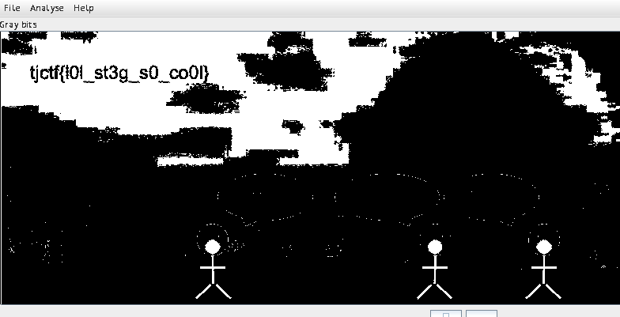

## web/lamb-sauce
> where's the lamb sauce

given the link: [lamb-sauce.tjc.tf](https://lamb-sauce.tjc.tf), we are presented with simple page with a YT-video embeded. 

If we take a look at source code, we see a comment
```html
 <body>
    <main>
      <h1>where's the lamb sauce</h1>
      <iframe [...]></iframe>
      <!-- <a href="/flag-9291f0c1-0feb-40aa-af3c-d61031fd9896.txt"> is it here? </a> -->
    </main>
  </body>
```

Upon viewing the file, we are greeted with the contents of the flag. 
lamb-sauce.tjc.tf//flag-9291f0c1-0feb-40aa-af3c-d61031fd9896.txt -> 

`tjctf{idk_man_but_here's_a_flag_462c964f0a177541}`


## forensics/fake-geoguessr
> We don't do guess challs here at TJCTF, so that means no Geoguessr 😞 Since I took this photo myself, though, you can find out precisely where it was taken, and some Bonus Content™️, from my Camera Model Name to the Circle Of Confusion. Maybe you'll find a flag there?


My first thought was to look at the metadata. So i ran `exiftool lake.jpg`
Note that this outputs a lot of results. However with power of `grep` , I can filter out the results not related to flag.

This very userful when analyzing alot of data.

I don't know much about 'regex', but this site gave me a few tips [How to Grep for Multiple Strings, Patterns or Words](https://phoenixnap.com/kb/grep-multiple-strings)

What ended up working:
```bash
~/Downloads $ exiftool lake.jpg | grep -E '{|}'
Copyright                       : tjctf{thats_a_
Comment                         : lot_of_metadata}
```
I grep for '{' and '}' because of the flag format.

`tjctf{thats_a_lot_of_metadata}`


## crypto/rsa-apprentice
> My friend sent me this secret message but I can't figure out how to decrypt it! Can you help?

We are given the file, problem.txt:
```bash
n = 1216177716507739302616478655910148392804849
e = 65537
c1 = 257733734393970582988408159581244878149116
c2 = 843105902970788695411197846605744081831851
```

It's clear that this is a challenge related to rsa. And by the looks of, there's two different ciphertexts

I fire up [RsaCtfTool.py](https://github.com/Ganapati/RsaCtfTool) , running all attack methods and putting in `c1` as `--uncipher` 

```bash
python RsaCtfTool.py -n 1216177716507739302616478655910148392804849 - e 65537 --uncipher 257733734393970582988408159581244878149116

private argument is not set, the private key will not be displayed, even if recovered.

[*] Testing key /tmp/tmppgw6fa65.
[*] Performing cube_root attack on /tmp/tmppgw6fa65.
[*] Performing qicheng attack on /tmp/tmppgw6fa65.
[...]
[*] Performing siqs attack on /tmp/tmppgw6fa65.
[*] Yafu SIQS is working.
[*] Yafu SIQS is working.

Results for /tmp/tmppgw6fa65:

Unciphered data :
HEX : 0x0000000000746a6374667b6e30745f73305f
INT (big endian) : 9223392496036841594411919028319
INT (little endian) : 8292154073973741962166584067276685520666624
STR : b'\x00\x00\x00\x00\x00tjctf{n0t_s0_'
```

And we receive the first part of the flag with a "siqs" attack
[Prime Wiki - Self-initializing quadratic sieve](https://www.rieselprime.de/ziki/Self-initializing_quadratic_sieve)
^^ Worth reading.

First part obtained! `\x00\x00\x00\x00\x00tjctf{n0t_s0_` -> 

This time for obtaining the last part of the flag, we know which attack is proven to work, thus we can specify it and save some time
```bash
python RsaCtfTool.py -n 1216177716507739302616478655910148392804849 -e 65537 --uncipher 843105902970788695411197846605744081831851 --attack siqs
private argument is not set, the private key will not be displayed, even if recovered.

[*] Testing key /tmp/tmpnw93d7q6.
[*] Performing siqs attack on /tmp/tmpnw93d7q6.
[*] Yafu SIQS is working.
[*] Yafu SIQS is working.

Results for /tmp/tmpnw93d7q6:

Unciphered data :
HEX : 0x000000005333637572335f4372797037307d
INT (big endian) : 1687511414390906761929331475689597
INT (little endian) : 10905442986622476626502974751181581007716352
STR : b'\x00\x00\x00\x00S3cur3_Cryp70}'
```

The flags:

`\x00\x00\x00\x00\x00tjctf{n0t_s0_` and `\x00\x00\x00\x00S3cur3_Cryp70}`

Combine into:

tjctf{n0t_s0_S3cur3_Cryp70}


## forensics/cool-school

> Wow TJ is such a cool school! This image really captures the vibes. But something seems off about the image...

Obvious hint that this is a steg chall, and that maybe it's physical rather hidden in the actual bits.

So i use stegsolve to manipulate the color(planes) in the image:
[stegsolve.jar](https://github.com/eugenekolo/sec-tools/tree/master/stego/stegsolve/stegsolve)

```bash
java -jar stegsolve.jar
```


![[Pasted image 20220514141707.png]]
You can try out the different modes by click the arrows in the bottom. and the "grey bits" seems to show the flag fine.

- tjctf{l0l_st3g_s0_co0l}


## crypto/flimsy-fingered-latin-teacher
> Oh no! My Latin teacher likes to touch type on her Dell laptop, but she has trouble keeping her fingers on the right keys in home row. The letters she's typing out don't really make sense. Can you help me understand what she's saying so she doesn't get upset when I come to her confused?

Ciphertext:
`ykvyg}pp[djp,rtpelru[pdoyopm|`


This teacher types a key left of the desired key, (On [US keyboard layout](https://qph.fs.quoracdn.net/main-qimg-081293d4fe4aeb76ec6cf4cae7af491a))
We can conclude the forementioned by the first letter of the ciphertext, because we know the first letters of the plaintext. 
The flag format is: tjctf{...}, which we can test against our hypothesis:

First letter is y, where is the key to right of t
next is k, which is to the right of j

`yk` ->`tj` => `tjctf{oops[...]`,  

Continuing the deciphering logic results in:

`ykvyg}pp[djp,rtpelru[pdoyopm| `-> tjctf{oopshomerowkeyposition}

##
